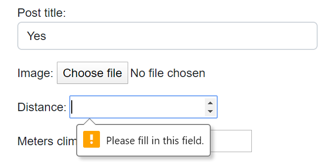

# South West Walkers

[Please see link to the final project](https://south-west-walkers.herokuapp.com) (holding ctrl when clicking this link will open it in a new tab)

South West Walkers is Django built blog to record treks in the Brecon beacons. It gamify's hiking allowing user's to 'collect' peaks and achievements by walking distance challenges and climbing different mountains in the region. By completing hikes and uploading new posts the blog tracks a user's profile and adds their achievements to it which can be viewed by the user on their own profile page to inspire them to keep going. 

This site was built using Django as its framework with HTML, CSS, Bootstrap, JavaScript & Python. The database is created using SQL through PostgreSQL. 

## Contents

* [User Experience](#user-experience)
    * [Site Aims](#site-aims)
    * [Opening Discussions](#opening-discussions)
    * [User Stories](#user-stories)

* [Design](#design)
    * [Colours](#colour-scheme)
    * [Typography](#typography)
    * [Wire Frames](#wire-frames)
    * [Features](#features)
    * [Future Features](#future-features)
    * [Navigation bar](#navigation-bar)
    * [All Auth](#all-auth)
        * [Sign Up](#sign-up)
        * [Login](#login)
        * [Logout](#logout)
    * [Create a user profile](#create-a-user-profile)
    * [User Profile](#user-profile)
    * [Home](#home)
    * [Pagination](#pagination)
    * [Tips](#tips)
    * [About](#about)
    * [Add Post](#add-post)
    * [Detailed View](#detailed-view)
    * [Delete Post](#delete-post)
    * [Footer](#footer)
    * [Further Defensive Design](#further-defensive-design)

* [Future Features](#future-features)

* [Agile Working](#agile-working)

* [Technologies Used](#technologies-used)
    * [Languages](#languages)
    * [Workspace](#workspace)
    * [Version Control](#version-control)
    * [Responsive Design](#responsive-design)
    * [Documentation](#documentation)
    * [Site Design](#site-design)
    * [Database Design](#database-design)
    * [Frameworks, Libraries and Others](#frameworks-libraries-and-others)

* [How to Deploy](#deployment)

* [Testing](#testing)
    * [Solved Bugs](#solved-bugs)
    * [Known Bugs](#known-bugs)

* [Credits](#credits)
    * [Code](#code)
    * [Content](#content)
    * [Media](#media)
    * [Acknowledgements](#acknowledgements)

## User Experience

### Site aims

While Strava exists to map peoples runs and walks, it tracks time, distance and the route. It then offers medals for speed of each segments. It does not, however, reward reaching the peaks of mountains in certain ranges and as mountain peaks are usually reached by walking / hiking the medal system in Strava is not as rewarding to hikers who would never travel fast. 

All trails and Kamoot offers fantastic hiking routes but do not track which you have completed. They also do not reward reaching the peaks of trails and mountains. 

Hiking is a fantastic way to lose weight and improve your mental health, to spend time with friends and family. By 'gamifying' it more people would hike and learn to love a great sport that people of all ages can take part in. 

This site aims to allow user's to track walks / hikes which they have completed, the peaks they reached on this walk, the distance travelled and meters climbed. This is stored in a database which then shows on the user's profile which peaks they have to reach, those they've completed and achievements they have... achieved. This will be for the Brecon beacons, a mountain range in south wales with an aim to expand to all ranges as soon as I have learnt the skills necessary to do this. 

### Opening Discussions 

* I wanted to create a website linked to a database, which is able to authenticate a user by having them log in. 
* The site would allow user's to track which Cairns (aka hill / mountain) peaks they have climbed. To offer challenges for hiking distances and reached a number of peaks in the area and to allow other details of the walk such as notes on how it felt and images of the walk to inspire others to get out there and hike. 
* This would be tracked through the user making posts similar to strava (though without mapping / user tracking abilities as this would be outside of the course material) where they record a walk they had done
* I wanted to be able to add, edit and delete posts, to comment and like others and your own posts. 
* I want the user to have a profile which tracks their progress, shows their posts, their progress and achievements. 

[Back to contents](#contents)

### User Stories

* As an Admin I should be able to:
    * Log into a user interface so that I can easily manage the database/s
    * Filter and search models data from the admin page to easily find posts / profiles and delete them if necessary
    * Navigate the admin panel with relative ease to view, search, add and delete posts and or profiles if needs be.
    * user's will be able to comment. If offensive the admin should be able to delete the comment

* The project will require authentication. An un-authenticated user will be able to: 
    * Immediately understand the sites purpose to see if is to their taste and if they want to register
    * Create / register for an account to be able to post and build their profile
    * Browse posts of all user's and look at detail only (no comments or likes)

* A register & logged in user will be able to: 
    * Create posts and record peaks / cairns reached, distance walked and meters climbed, edit and delete their own previously created posts
    * Comment on their own and others posts
    * Like or "star" posts to show they are impressed 
    * View their profile where they can add social media links and a profile picture, view progress towards climbing the regions hills and achievements they've completed. 
    * access a detailed guide or 'tips' on how each page can and should be used. 
    
* Any user of the site will get to: 
    * Be met with an enjoyable colour scheme and uniform site style in order for the entire site to stimulate a positive response.
    * Enjoy the site from any screen size (within reason)
    * Follow smooth navigation or, in theory, type in a URL in order to reach a page of the site
    * See a guide for how each page should be used

* User Stories dropped as part of the agile process
    * Create an interactive map showing the location of peaks / cairns to be climbed and if they have or have not been climbed yet
    * View and connect with other user's profiles

I then analysed this in terms of estimated time to complete knowing that I should prioritise user stories and these should not be more than 60% of the timebox user story points. Each story implementation would be finished in a pre-agreed timeframe with myself and I will work in a fashion that prevents me overrunning whereever possible. I will allow very slight extentions where a breakthrough is within 5 minutes of the finish time. Afterwhich all performance is reviewed and process and tested to see if the goals were met.

The user stories above are broken down into separate parts to creat epics which are stored on my kanban board available [here](https://github.com/cwallacebailey/Django-SouthWest-Walkers/projects?type=classic). Once completed or in progress they are moved from to do section of the board. A satisfying process. 

[Back to contents](#contents)

---

## Design

### Colours

I went with a Scandanavian vibe for the sites colours which have been used throughout the site. 

[Back to contents](#contents)

### Typography

Two fonts were used for this project, 'Uchen' from google fonts and where this would not work, sans-serif takes over. Sans-serif fonts are easy to read for people with dyslexia and partially visually impaired user's. 'Ulchen' is also very easily read. 

[Back to contents](#contents)

### Wireframes

#### Home Page 

Home page views below: 

Desktop

Mobile

#### About Page

About page views below: 

Desktop

Mobile

#### Form Page

Form page views below including allauth: 

Desktop

Mobile

#### Profile

Profile views below: 

Desktop

Mobile

### Features

#### Navigation bar

The navigation bar changes depending on user status and screen size and allows the user to easily login, sign up and logout. They can access all key areas of the site through the nav bar which appears on each page. If logged with a profile created in this includes:

* Home - shows the blogs posts which can be clicked through to see the detailed views
* About - gives an overview of the sites purpose
* Tips - This changes depending on the page the user is viewing or if they are logged in or not
* Logout - allows user to logout
* Profile - view the user's profile, created 

If the user is logged in with no profile instead of a link to profile they see "Create Profile" instead:

If not logged in / a new user with no account: 

* Home - as described above
* About - as described above
* Tips - as described above, as not logged in this will always prompt the user to sign up or sign in. 
* Login - allows user to login
* Sign Up - allows the user to create an account

When viewed on a smaller screen, such as a phone, the navbar compresses to look like the below:

The Navbar shows the site logo, which is also a link to home. On the footer a hiker is included, this was excluded on the nav bar due to the additional space it took up which made the site look less neat. 

[Back to contents](#contents)

### All Auth

#### Sign Up

If a user is new to the sign they have the option to sign up. This uses allauth so I wont go into a huge amount of detail however when the user 

If the username has already been taken the form refreshes and the user is asked to pick another one. 

If the password is not deemed strong enough the user will see the below: 

[Back to contents](#contents)

#### Login

If the user has an account already they are able to sign in, they can even select "remember me" on the login page. If they enter a password that is incorrect they get the error message seen below:  

Once they have logged in they will be met by a message to confirm they have logged in as they are redirected to the home page

[Back to contents](#contents)

#### Logout

If the user is logged in they are able to logout through the link in the nav bar and the footer. They will be met with the page below

Once signed out they will be redirected to the home page and see the message below: 

[Back to contents](#contents)

#### Create a user profile

Once a user has signed in they are able to create a profile using the link in the navbar. They are taken to the page below: 

The only section of this form that has to be completed is the display name. If the user tries to update their profile without one they will be met with the message below: 

To prevent the user putting sordid or incorrect links into their user profile checks are in place that the instagram link has to include https://www.instagram.com. This pushes the user to copy and past a link and stops any other social media site being put in this section of the form. 

If they attempt to they are met with the message below: 

If they successfully create their profile they are redirected to the home page and will see the 'profile' link in the navbar. 

[Back to contents](#contents)

#### User Profile

The user profile has multiple roles. At the top the user's profile picture is shown alongside their display name, the total distance they have walked, the number of mountain peaks they have reached as well as their social media links and the option to update their profile if they should want to change their display name or profile picture / social media links. 

If the user has not added social media links they are met with a paragraph saying they would be able to see links to them if they added any in the update profile section. 

If they do add social media links font awesome icons are added which change coluor on hovering, the icons change depending on the social media link they have added to their profile: 

The user has the option to add a profile picture. If no profile picture is used then a default image is used seen in the snap shot above. If they add their own the default image is replaced with this

The user profile displays all posts the user has made, paginated by 6 shown in rows of 3. This allows the user to see everything they have done and feel a sense of pride over their achievements. Note pagination will be explained in the home section. 

The user is able to see their progress towards walking all of the Brecon beacons major peaks which is picked up from any posts they have added to the blog. Peaks reached get a gold mountain next to them and are put into the "You've conquered:" section. Peaks still left to walk have a silver hiker symbol and are left in the "Still left to conquer:" section

This section of the profile picture has buttons which switch the tabs the user sees. If they hit "Achievements" they see the achievements and if they hit "progress" they go back to the progress page. Achievements are a result of accumulated posts so if the user covers 50km distance walked over any number of posts they receive an award, if they reach 5 cairns / mountains they receive another award. This is designed to keep the user moving and posting. 

[Back to contents](#contents)

#### Home

The home page simply shows the posts made by all user's, paginated by 8 in rows of four on a larger screen, rows of 1 post on mobile. When you hover over the posts they change colour to highlight that you are hovering over them. This interactivity is designed to provoke a positive response with the user. 

[Back to contents](#contents)

##### Pagination

Pagination comes with a navigation bar at the bottom, available on both the home and profile page. if the user is on the first page they are only able to see right pointing arrows as there is no previous page to go to. Clicking the double arrows will take you all the way to the last page, single arrow will take the user to the next page. 

If there are previous pages of posts to view the user will see left facing arrows, as shown below: 

This allows clear navigation of posts for the user. 

[Back to contents](#contents)

#### Tips

In order for usage of the site to be clear at all times I added a "tip" function to the navbar which relies on javascript to change the modal's message depending on the page the user is viewing. The tips item clearly seen in the navigation bar gives the user instructions on how each page can and should be used. It appears as a modal on each page and the text changes depending on whether the user is logged in, logged out or where they are in the site. 

If the user is not logged in they are welcomed to the page and prompted to log in or sign up, this message will occur regardless of where they are in the site: 

If the user is logged in on the home page they see the below: 

If the user is creating or updating their profile they see the below making the URL item clear: 

If the user is on the about page or logging out they see the message below as in theory no explanation would be required for anyone on these pages. 

If the user is creating or editing a post they see the tip below which makes clear that up to 3 images and 3 cairns / mountains can be added to each hike: 

[Back to contents](#contents)

#### About

The about page shows the sites purpose and is available through the navbar: 

When viewed on a mobile the image is no longer visible and a simple text box appears: 

[Back to contents](#contents)

#### Add Post

A user can add a post once they have logged in. They are prompted to complete the form through a series of checks. The only sections of the form which must be filled in to submit the form are the title, distance (all works would have a distance, otherwise they would be a stand) and the notes to review their walk.  

Up to three images can be added and three cairns / mountains. As the three peaks is an enormous challenge in the Brecons it is likely that three walks would be the most someone would do in a day. If they do more this would be pushed to two walks. 

The option to fill in a second cairn / mountain or second image appears once the first has been filled in. 

The first cairn can be deleted once entered and the second mountain / cairn  kept with no ill effects however this is all summed into a single column in the profile view so does not matter. 

The the user tries to submit the form without a title or distance they are met with the below: 

No distance: 

Once they have submit the post correctly they will be taken to the main home page where they can see it as the most recent post. 

[Back to contents](#contents)

#### Detailed View

The detailed view allows user's to see a greater level of detail on each post than presented on the home page including the three images the user added (if they used this option) presented as a slide show. Otherwise a default image will be shown if no images were added to the post. Finally if only one image added by the user then no slide show is available and the "next image" link is hidden. 

This appears under the title and the user's chosen display name. 

If the user reached the top of mountains / cairns these will be displayed on the detail view. If they did not then the caption reads "No cairns reached, still proud". We want to inspire user's to walk regardless of reaching the tops of mountains for the site to be fully inclusive. 

Defensive design is employed here as the user will only see the links to update or delete the post if they are the creator of the post

If a user is logged in they will be able to star or comment on the user's post: 

The comments are then ordered by date created. 

I have not opted to approve any comments or posts similar to facebook or strava. Instead the user if bullying or antisocial in anyway can simply be deleted from the admin panel. 

A post can be 'starred' similar to a like system, the method for this was taken from the code institute tutorial video. When not starred by a user the star appears empty. If you star it then it fills with gold: 

If the user is not logged in or signed up they will see the below level of detail with the aim of inspiring people to join and signup by letting them see what other people are achieving: 

[Back to contents](#contents)

#### Delete Post

A post can be deleted using djangos built in system. Any user can delete their own posts using the delete post button on the detail view. They are taken to a new screen to confirm and then taken to the home screen if they confirm. 

[Back to contents](#contents)

#### Footer

The footer holds the site logo, social links for the site (fillers used for now) and the option to logout when logged in. If not logged in the footer shows the option to sign up or login. 

When compressed the footer items are hidden to make viewing easier

When you hover over items on the footer they change colour to give a greater sense of user interactivity

[Back to contents](#contents)

#### Accessing tabs if not logged in

If any user somehow gets to the add post page, create profile page they are met with the below and cannot perform other actions. 

If the access another user's post and attempt to delete it or update is they are met with the below

[Back to contents](#contents)

### Further Defensive Design

404 errors and 500 errors are met with the page below that allows a user to head home instead of being stuck on that page, regardless of how they got there. 

If a user manages to get to the update or delete page of another user's post they are met with the below, preventing them from actually updating the post: 

The same process is used to prevent them from updating someone elses profile: 

[Back to contents](#contents)

### Future Features

These are endless, however key items below

* I would like to design a map which lights up in sections when a user has hiked that section of the map to further gamify the system. In addition it would show the location of the other major peaks of the region which they have yet to do with details of the peak upon hovering over it. 
* allow posts to be loaded in from strava and the peaks identified automatically. This and the item above would have to be done for this project to become a viable project. 
* I had everything in place to comment on comments, so user's could respond to any comment made on their post however the django system I had in place would only take a comment from the first text box on the screen rather than that the user was typing into. I ran out of time to fix this. 
* Block swear words and profanities, though the only way I could think to do this was to create a list of them as an array and then ensure they were not in the comment or post notes when a user submitted. To do this I would have to myself write a list of the swear words and don't think its suitable for a course reviewer to have to read all of these. 

[Back to contents](#contents)

### Agile Work

I used the Kanban board from GitHub for this process, splitting user stories into a number of "epics" and linked each story to its related "epic". I manually toggled the priority offline so I could see the must-haves, should-haves, nice-to-have and not happening. Ticket priority would vary in "sprints" and I tried my best to stick to these, in one noted moment I failed and ran out of time to add it, this is the ability to respond to comments mentioned in my README. As it was a nice-to-have I dropped the process due to time constraints. 

Agile working is obviously effective however I found it a challenge to both be learning on the go and to work as a single-person team. I tried to make it a habit to stop after each sprint to evaluate the MVP and re-prioritize the tasks if required. This would depend on how necessary each function was for the releasable product, generating a sort of "time" to "how necessary a feature was" ratio. 

## Technologies Used

### Languages, frameworks and add ons used

* [HTML5](https://developer.mozilla.org/en-US/docs/Web/Guide/HTML/HTML5)
* [CSS3](https://developer.mozilla.org/en-US/docs/Web/CSS)
* [JavaScript](https://developer.mozilla.org/en-US/docs/Web/JavaScript)
* [Python](https://www.python.org/)
* [Bootstrap](https://getbootstrap.com/) was used for quick formatting
* [Font Awesome](https://fontawesome.com/) used across the site for icons

[Back to contents](#contents)

#### Workspace

[Git](https://gitpod.io/) was used as a workspace to build this project, and fulfilled the version control aspect of the course through regular commits with pushes to github

[Back to contents](#contents)

---

### Responsive Design

#### Am I Responsive Design

[Am I Responsive Design](http://ami.responsivedesign.is/#) was used to check the responsive design of the site, and to create the final site image.

[Back to contents](#contents)

---

#### Favicon.io

The favicon was made from a screen shot of a font awesome icon

[Back to contents](#contents)

---

## Hosting

#### Heroku

[Heroku](https://www.heroku.com) deploys the live site.

## Deployment

[Please click here for all Deployment steps and requirements](DEPLOYMENT.md).

[Back to contents](#contents)

---

## Testing

### Solved Bugs

This is undoubtedly a list thats should come with a trigger warning. Key bugs noted below:

1. The details from my static files would not load onto heroku. This was a long session with the tutors who have my everlasting thanks. Ultimately it was a rogue "/" infront of my  so . Once removed and pushed through everything started to work.

2. JS wouldn't run and would produce console errors. This is because when the script ran on each page it would look for all classes of which only some are on certain pages. I added if statements to these sections of code so they would only run on the pages in which the id's and classes they are looking for could be found. This led to another error in which my IF statements were in blocks. I had to remove these from the blocks in order for the code to run through js hint. 

3. In order for {{ distance|intcomma }}Km to work on my profile pages, which formats the figures used in the total distance walked, I had to load  at the top of the screen. I had no idea about this and spent some time staring at an error page before finding out. 

4. I wanted the user's posts to appear on their profile, similar to strava. I had no idea how this would work with the Profile model being run on the profile view but the posts being part of the Posts view. I feel like I missed this in the tutorial videos and cannot believe how long it took me to find the answer. In the end the below additions to my code is all it took: 

site_page = request.GET.get('site_page')

Then render: 

"current_page": current_page,

Ultimately running it as a variable and then passing it through the view meant I could use a for loop on it to find all the user's own posts. 

5. My tip modal was displaying the tips for adding a new post. This had to be solved by adding a id="no-tip" to the about page as well as the allauth logout page and then using JS to look for this ID which if present was used to block text appearing in the modal. 

6. The profile shows progress and achievements in the same section using a button to decide which you would like to see. This runs by changing the div css of the item you do not want to view to display: none. However this wasn't working for achievements which was appearing at the bottom of the progress bar. I updated achievements display to always be none unless the JS function changes it to "Block". 

7. Horrifically, my env.py file was exposed. I could not work out how it happened, instead I had to delete and re-create the git ignore, delete my env.py and then create a new cloudinary and postgres database losing a lot of my walks. This shows the dangers of being exposed and a lesson I will take forwards as it was a few hours of work to fix. 

8. When creating automated tests the lessons from Code Institute did not prepare me for the tests alwasy failing because I did not run them with --debug at the end of Python3 manage.py test. I take it debug was automatically switching to false so testing could not be done. In addition I had to switch to the SQlite database in order for tests to run 

9. When registering with an email a 500 error was given and this was caused by settings being absent in my settings.py file for my all auth files. 

10. when refreshing a page, particularly the detailed view of a post after submitting a comment, the comment would be re-added to the database creating a duplicate. I used a "return HttpResponseRedirect(reverse(...." to fix this issue. 

11. Between coding sessions I received an error message telling me my project could not connect to my Heroku Postgres database when running the server locally. This was due to a heroku database update and I needed to add in a new "DATABASE_URL".

### Unsolved Bugs

None at the time of submission

## Credits

All thanks to the code institute tutors. 

### Code

Key items here and a nod to code institute lessons: 

1. In order for the commentary and star system to work I used the knowledge and notes made during the code institute lessons as well as the log in and log out messages. 
2. I used https://www.w3schools.com/howto/howto_js_slideshow.asp for the slideshow on the detailed view, changed only slightly to fit my needs
3. the 404 and 500 error method was taken from the following link https://studygyaan.com/django/django-custom-404-error-template-page
4. Pagination was learned from here, thank you John Eldar https://www.youtube.com/watch?v=N-PB-HMFmdo

### Images: 

Image below which has not been changed in any way. 

https://www.pexels.com/photo/brown-and-green-mountains-under-white-sky-10874914/