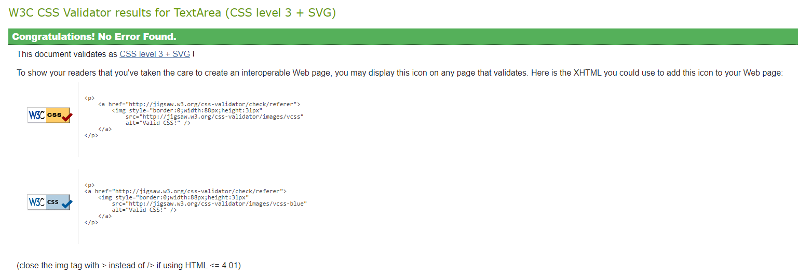
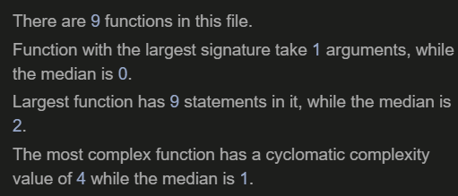

# Testing

### Contents 

* [Manual Testing](#manual-testing)
  * [Devices and Browsers](#devices-and-browsers)
  * [User Story Testing](#testing-user-stories) - To Do
  * [Testing Technologies](#testing-technologies)
  * [Navigation](#links-and-navigation)
    * [Navigation Bar](#navigation-bar)
    * [Modals](#modals)
  * [External Links](#external-links)
  * [Styling and Layout](#styling-and-layout)

* [User Access](#user-access)

* [Site Functions](#functions)
  * [Register](#register)
  * [Log In](#log-in)
  * [Log Out](#log-out)
  * [Add Posts](#add-posts)
  * [Update Posts](#edit-posts)
  * [Delete Posts](#delete-posts)
  * [Create Profile](#create-profile)
  * [Update Profile](#update-profile)
  * [404](#404)
  * [500](#500)

* [Validation](#Validations)

* [Database](#database)

* [Responsive Design](#responsive-design)
* [Lighthouse](#lighthouse)

#### Desktop

1. Chrome
    * All tested and working correctly.

2. Edge
    * All tested and working correctly.

3. Mozilla Firefox
    * All tested and working correctly.

#### Mobile

1. Chrome
    * All tested and working correctly.

2. Edge
    * All tested and working correctly.

3. Mozilla Firefox
    * All tested and working correctly.

* Site was tested on Chrome, Firefox and Edge. IE was ignored as it is no longer used
* The website was tested on multiple device sizes, including:
  * Galaxy S5
  * Pixel 2 XL
  * Iphone 5 SE
  * Iphone 6/7/8
  * Iphone 6/7/8 Plus
  * Iphone X
  * iPad
  * iPad Pro

### Testing tech

* HTML markup validator was used for all HTML code - [W3C HTML Markup Validator](https://validator.w3.org/).
* CSS was validated with [W3C Jigsaw CSS Validator](https://jigsaw.w3.org/css-validator/).
* JavaScript was validated with [JSHint](https://jshint.com/).
* Python was validated using [pep8](http://pep8online.com/).
* Responsive design was tested with [Lighthouse](https://developers.google.com/web/tools/lighthouse)

1. W3C HTML Markup Validator
    * [Homepage](https://validator.w3.org/nu/?doc=https%3A%2F%2Fms4-lead-shot-hazard.herokuapp.com%2F)

2. W3C CSS Validator
    * No errors in the CSS file, see results below: 

3. JSHint
    * [JSHint](https://jshint.com/)
    * The only comments from JSHint are about template literals, the `let` keyword and there are no JavaScript errors in this project.

