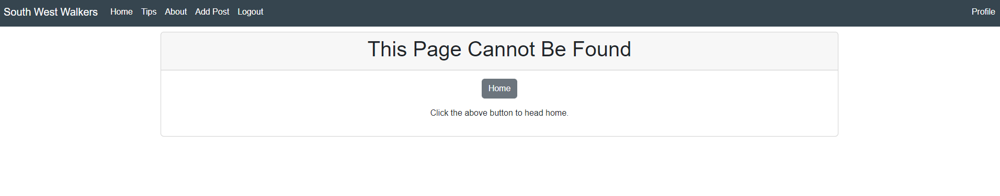
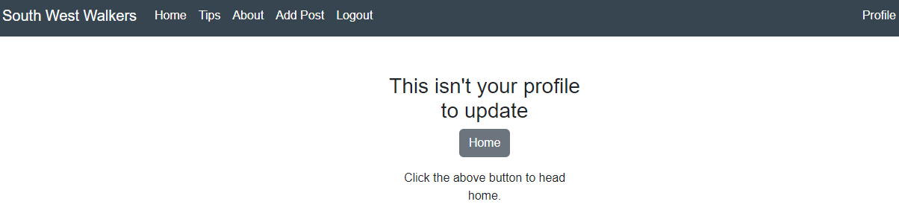

# Testing

### Contents 

* [Manual Testing](#manual-testing)
  * [Devices and Browsers](#devices-and-browsers)
  * [User Story Testing](#testing-user-stories) - To Do
  * [Testing Technologies](#testing-technologies)

* [Site Functions](#functions)
  * [Register](#register)
  * [Log In](#log-in)
  * [Log Out](#log-out)
  * [Add Posts](#add-posts)
  * [Update Posts](#edit-posts)
  * [Delete Posts](#delete-posts)
  * [Create Profile](#create-profile)
  * [Update Profile](#update-profile)
  * [404](#404)
  * [500](#500)

* [Lighthouse](#lighthouse)

* [Automated Testing](#automated-testing)

#### Desktop

1. Chrome
    * All tested and working correctly.

2. Edge
    * All tested and working correctly.

3. Mozilla Firefox
    * All tested and working correctly.

[Back to contents](#contents)

#### Mobile

1. Chrome
    * All tested and working correctly.

2. Edge
    * All tested and working correctly.

3. Mozilla Firefox
    * All tested and working correctly.

[Back to contents](#contents)

* Site was tested on Chrome, Firefox and Edge. IE was ignored as it is no longer used
* The website was tested on multiple device sizes, including:
  * Galaxy S5
  * Pixel 2 XL
  * Iphone 5 SE
  * Iphone 6/7/8
  * Iphone 6/7/8 Plus
  * Iphone X
  * iPad
  * iPad Pro

[Back to contents](#contents)

### Testing tech

* HTML markup validator was used for all HTML code - [W3C HTML Markup Validator](https://validator.w3.org/).
* CSS was validated with [W3C Jigsaw CSS Validator](https://jigsaw.w3.org/css-validator/).
* JavaScript was validated with [JSHint](https://jshint.com/).
* Python was validated using [pep8](http://pep8online.com/)
* Responsive design was tested with [Lighthouse](https://developers.google.com/web/tools/lighthouse)

1. W3C HTML Markup Validator
    * All pages were checked, only one note of unclosed Divs on the update profile page however on inspections these divs are definitely closed. 

2. W3C CSS Validator
    * No errors in the CSS file, see results below: 

3. JSHint
    * [JSHint](https://jshint.com/)
    * The only comments from JSHint are about template literals, the `let` keyword and there are no JavaScript errors in this project.

[Back to contents](#contents)

### Site Functions

Ultimately all links and navigation tools work from any page the user is on at all times on any browser except IE which is no longer functional. The users can access all pages and there is defensive design to stop users being able to access posts which are not theirs as well as profiles which they do not own. Details of what was tested can be seen below: 

#### Register

* Users are able to register using the allauth form which takes them to the home page upon compeltion. They can acces this from any page where the nav bar is showing and the option is only available if they are not logged in which occurs upon signing up.

#### Log In

* Users are able to login using the allauth form which takes them to the home page upon completion. They can acces the link to login from any page where the nav bar is showing and the option is only available if they are not logged in which occurs upon hitting the log in button in either the nav bar or the footer. 

#### Log Out

* Users are able to log out using the allauth form which takes them to the home page upon completion. They can acces the link to logout from any page where the nav bar is showing and the option is only available if they are currently logged in. The log out button is then viewable / accessible from either the nav bar or the footer. 

#### Add Posts

* Users are able to create posts using the add post form which takes them to the home page upon completion. They can acces the link from any page where the nav bar is showing and the option is only available if they are currently logged in. 

#### Update Post

* Users are able to update only their own posts using the update post form which takes them to the detailed view of the post upon completion. They can acces the link from any post to update that particular post. The option is only available if they are currently logged in and it is their post. If they try to update someone else's post they are told to return to the home page. 

#### Delete Post

* Users are able to update only their own posts using the delete post function provided by Django which takes them to the home view upon completion. They can acces the link from any post to delete that particular post. The option is only available if they are currently logged in and it is their post. If they try to delete someone else's post they are told to return to the home page. 

#### Create Profile

* Users are able to create a profile using the Profile Form which takes them to the home page upon completion. They can acces the link from any page where the nav bar is showing and the option is only available if they are currently logged in. 

#### Update Profile

* Users are able to update only their own profile using the update profile link which takes them to the update profile form using the update view. They can acces the link from any post to update that particular post. The option is only available if they are currently logged in and it is their post. If they try to update someone else's post they are told to return to the home page. 

#### 404

404 errors and 500 errors are met with the page below that allows a user to head home instead of being stuck on that page, regardless of how they got there. This has been thoroughly tested on the site and works at all times

If a user manages to get to the update or delete page of another users post they are met with the below, preventing them from actually updating the post: 

The same process is used to prevent them from updating someone elses profile: 

#### 500

As above, tested throughout the site where possible through altering the we address manually. Same notes for 404 below: 

404 errors and 500 errors are met with the page below that allows a user to head home instead of being stuck on that page, regardless of how they got there. This has been thoroughly tested on the site and works at all times

If a user manages to get to the update or delete page of another users post they are met with the below, preventing them from actually updating the post: 

The same process is used to prevent them from updating someone elses profile: 

### Lighthouse

#### Desktop Site

Both the desktop and mobile site received the same levels in the report, hence the screenshots are identical. I was happy with the accessibility and the SEO. The performance could be improved by using smaller images and I have added this to future features, by putting in a max size for images this could be sped up however through all the testing the site functions well so I am not alarmed by the amber score. 

The best practice alert can be seen below. This references the Jquery script for bootstrap so I have left it in and will take the 86 best practice. 

[Back to contents](#contents)

#### Mobile Site

Both the desktop and mobile site received the same levels in the report, hence the screenshots are identical and notes below are the same as above. 

I was happy with the accessibility and the SEO. The performance could be improved by using smaller images and I have added this to future features, by putting in a max size for images this could be sped up however through all the testing the site functions well so I am not alarmed by the amber score. 

The best practice alert can be seen below. This references the Jquery script for bootstrap so I have left it in and will take the 86 best practice. 

[Back to contents](#contents)

#### Automated Testing

I have created a number of automated testing functions, to test views and URLS. The testing coverage is not complete and has to be run with "--debug" added at the end of the command "python3 manage.py test ..." in order to work. This was found with the help of the tutors as unfortunately I could not get any tests to function before adding this to the command. 